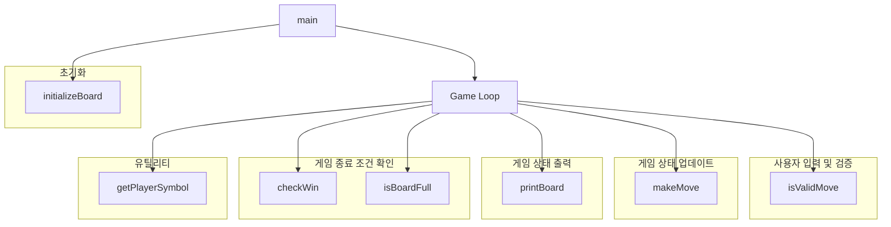
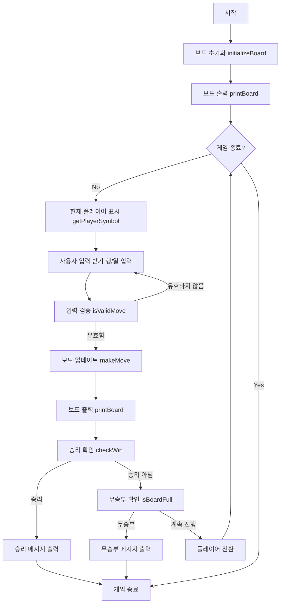
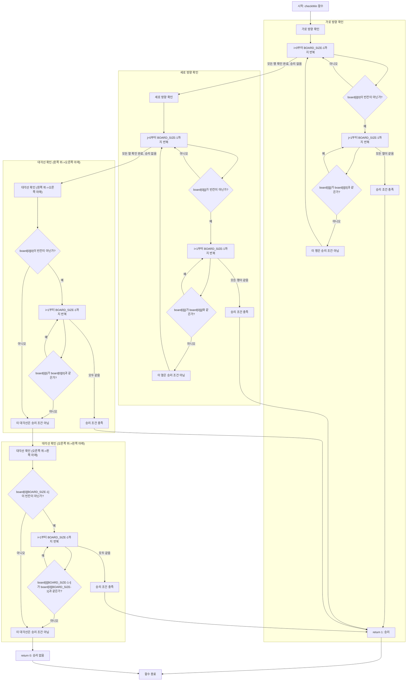
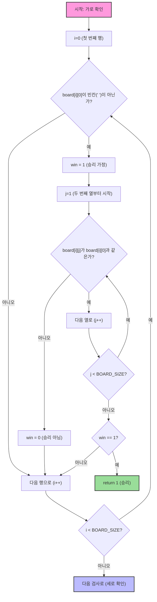

# Board Game

## 함수 구조도

```mermaid
graph TD
    A[main] --> B[initializeBoard]
    A --> C[Game Loop]
    C --> D[getPlayerSymbol]
    C --> E[isValidMove]
    C --> F[makeMove]
    C --> G[printBoard]
    C --> H[checkWin]
    C --> I[isBoardFull]
    
    subgraph "초기화"
        B
    end
    
    subgraph "사용자 입력 및 검증"
        E
    end
    
    subgraph "게임 상태 업데이트"
        F
    end
    
    subgraph "게임 상태 출력"
        G
    end
    
    subgraph "게임 종료 조건 확인"
        H
        I
    end
    
    subgraph "유틸리티"
        D
    end
```

## main 구조도

```mermaid
flowchart TD
    A[시작] --> B[보드 초기화 initializeBoard]
    B --> C[보드 출력 printBoard]
    C --> D{게임 종료?}
    D -- No --> E[현재 플레이어 표시 getPlayerSymbol]
    E --> F[사용자 입력 받기 행/열 입력]
    F --> G[입력 검증 isValidMove]
    G -- 유효하지 않음 --> F
    G -- 유효함 --> H[보드 업데이트 makeMove]
    H --> I[보드 출력 printBoard]
    I --> J[승리 확인 checkWin]
    J -- 승리 --> K[승리 메시지 출력]
    J -- 승리 아님 --> L[무승부 확인 isBoardFull]
    L -- 무승부 --> M[무승부 메시지 출력]
    L -- 계속 진행 --> N[플레이어 전환]
    K --> O[게임 종료]
    M --> O
    N --> D
    D -- Yes --> O
```

## checkWin 함수 구조도

```mermaid
flowchart TD
    A[시작: checkWin 함수] --> B[가로 방향 확인]
    
    subgraph "가로 방향 확인"
        B --> B1["i=0부터 BOARD_SIZE-1까지 반복"]
        B1 --> B2{"board[i][0]이 빈칸이 아닌가?"}
        B2 -- 예 --> B3["j=1부터 BOARD_SIZE-1까지 반복"]
        B3 --> B4{"board[i][j]가 board[i][0]과 같은가?"}
        B4 -- 예 --> B3
        B4 -- 아니오 --> B5[이 행은 승리 조건 아님]
        B5 --> B1
        B2 -- 아니오 --> B1
        B3 -- 모든 열이 같음 --> B6[승리 조건 충족]
        B6 --> Z[return 1: 승리]
    end
    
    B1 -- 모든 행 확인 완료, 승리 없음 --> C[세로 방향 확인]
    
    subgraph "세로 방향 확인"
        C --> C1["j=0부터 BOARD_SIZE-1까지 반복"]
        C1 --> C2{"board[0][j]가 빈칸이 아닌가?"}
        C2 -- 예 --> C3["i=1부터 BOARD_SIZE-1까지 반복"]
        C3 --> C4{"board[i][j]가 board[0][j]와 같은가?"}
        C4 -- 예 --> C3
        C4 -- 아니오 --> C5[이 열은 승리 조건 아님]
        C5 --> C1
        C2 -- 아니오 --> C1
        C3 -- 모든 행이 같음 --> C6[승리 조건 충족]
        C6 --> Z
    end
    
    C1 -- 모든 열 확인 완료, 승리 없음 --> D["대각선 확인 (왼쪽 위->오른쪽 아래)"]
    
    subgraph "대각선 확인 (왼쪽 위->오른쪽 아래)"
        D --> D1{"board[0][0]이 빈칸이 아닌가?"}
        D1 -- 예 --> D2["i=1부터 BOARD_SIZE-1까지 반복"]
        D2 --> D3{"board[i][i]가 board[0][0]과 같은가?"}
        D3 -- 예 --> D2
        D3 -- 아니오 --> D4[이 대각선은 승리 조건 아님]
        D1 -- 아니오 --> D4
        D2 -- 모두 같음 --> D5[승리 조건 충족]
        D5 --> Z
    end
    
    D4 --> E["대각선 확인 (오른쪽 위->왼쪽 아래)"]
    
    subgraph "대각선 확인 (오른쪽 위->왼쪽 아래)"
        E --> E1{"board[0][BOARD_SIZE-1]이 빈칸이 아닌가?"}
        E1 -- 예 --> E2["i=1부터 BOARD_SIZE-1까지 반복"]
        E2 --> E3{"board[i][BOARD_SIZE-1-i]가 board[0][BOARD_SIZE-1]과 같은가?"}
        E3 -- 예 --> E2
        E3 -- 아니오 --> E4[이 대각선은 승리 조건 아님]
        E1 -- 아니오 --> E4
        E2 -- 모두 같음 --> E5[승리 조건 충족]
        E5 --> Z
    end
    
    E4 --> Y[return 0: 승리 없음]
    
    Z --> F[함수 종료]
    Y --> F
```

### 가로줄 체크 구조도 예제

```mermaid
flowchart TD
    A[시작: 가로 확인] --> B["i=0 (첫 번째 행)"]
    B --> C{"board[i][0]이 빈칸(' ')이 아닌가?"}
    
    C -- 예 --> D["win = 1 (승리 가정)"]
    C -- 아니오 --> E["다음 행으로 (i++)"]
    
    D --> F["j=1 (두 번째 열부터 시작)"]
    F --> G{"board[i][j]가 board[i][0]과 같은가?"}
    
    G -- 예 --> H["다음 열로 (j++)"]
    G -- 아니오 --> I["win = 0 (승리 아님)"]
    
    I --> E
    H --> J{"j < BOARD_SIZE?"}
    J -- 예 --> G
    J -- 아니오 --> K{"win == 1?"}
    
    K -- 예 --> L["return 1 (승리)"]
    K -- 아니오 --> E
    
    E --> M{"i < BOARD_SIZE?"}
    M -- 예 --> C
    M -- 아니오 --> N["다음 검사로 (세로 확인)"]
    
    style A fill:#f9d,stroke:#333,stroke-width:2px
    style L fill:#9d9,stroke:#333,stroke-width:2px
    style N fill:#bbf,stroke:#333,stroke-width:2px
```